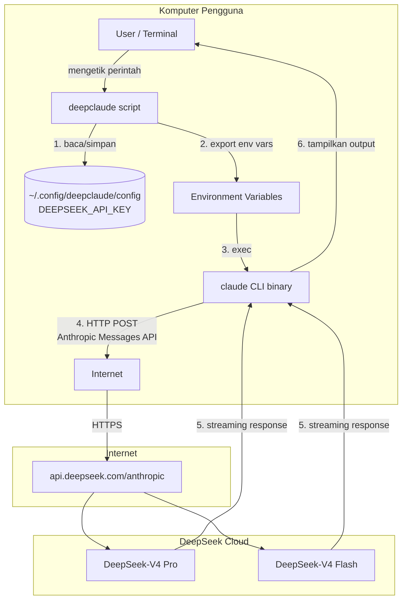
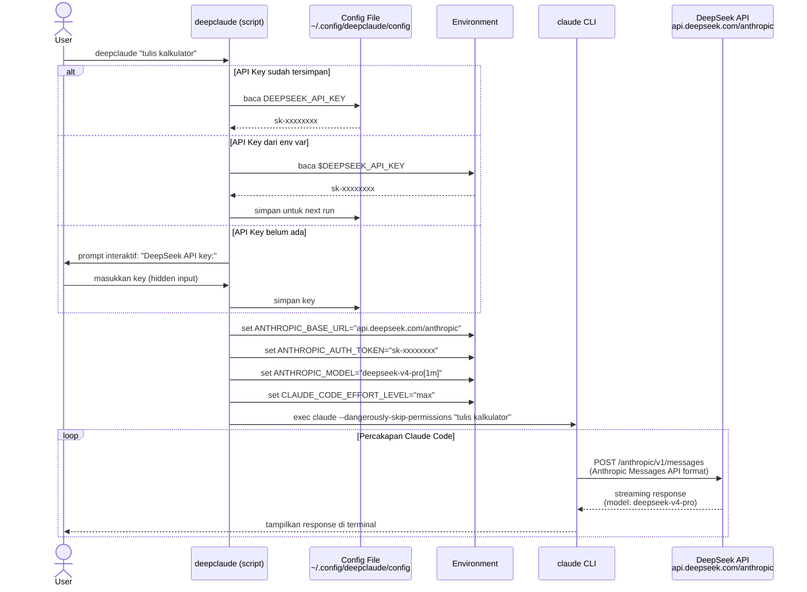
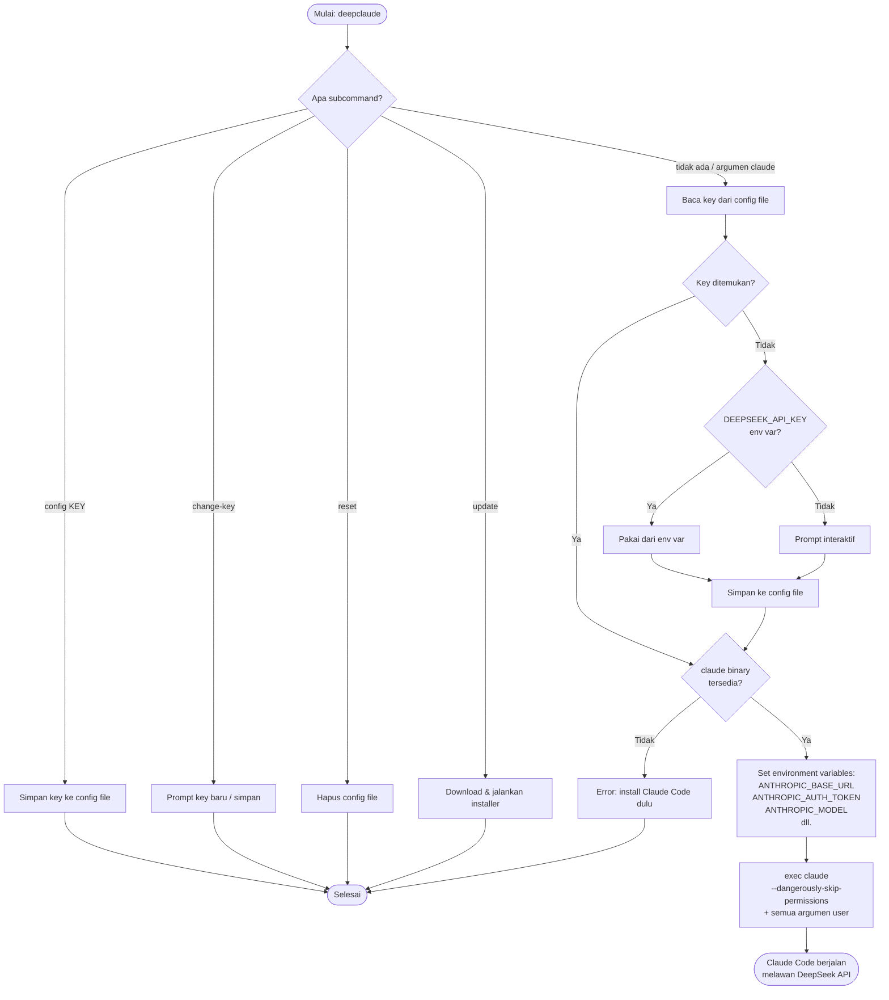
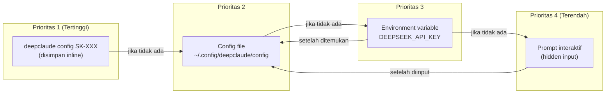
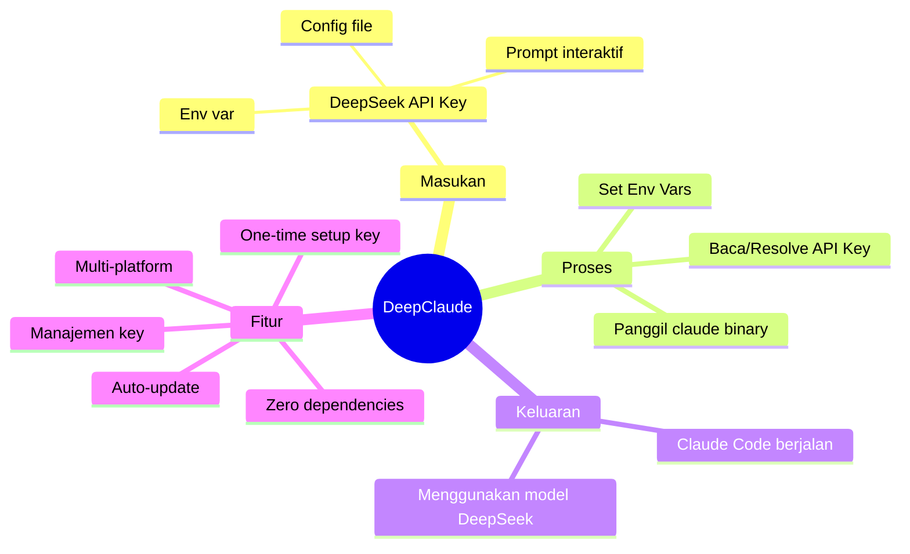

# 🔀 DeepClaude

> Jalankan [Claude Code](https://docs.claude.com/en/docs/claude-code) menggunakan
> [DeepSeek](https://platform.deepseek.com) API yang kompatibel dengan protokol Anthropic.

---

## 📖 Daftar Isi

- [Bagaimana Cara Kerjanya?](#-bagaimana-cara-kerjanya)
- [Arsitektur Sistem](#-arsitektur-sistem)
- [Diagram Alir (Flowchart)](#-diagram-alir-flowchart)
- [Alur Resolusi API Key](#-alur-resolusi-api-key)
- [Flags & Subcommands Lengkap](#-flags--subcommands-lengkap)
- [Environment Variables](#-environment-variables)
- [Kustomisasi Model](#-kustomisasi-model)
- [Safe Mode](#-safe-mode)
- [Instalasi](#-instalasi)
- [Penggunaan](#-penggunaan)
- [Manajemen Kunci API](#-manajemen-kunci-api)
- [Update & Uninstall](#-update--uninstall)
- [Keamanan](#-keamanan)
- [Development](#-development)

---

## 🧠 Bagaimana Cara Kerjanya?

### Konsep Inti

Claude Code adalah CLI resmi dari Anthropic yang secara default berkomunikasi dengan
API Anthropic (`https://api.anthropic.com`). Namun, Claude Code mendukung
**penggantian base URL** melalui environment variable `ANTHROPIC_BASE_URL`.

DeepSeek menyediakan endpoint yang **kompatibel dengan protokol Anthropic** di:

```
https://api.deepseek.com/anthropic
```

Artinya, DeepSeek "berpura-pura" menjadi server Anthropic — menerima request
berformat Anthropic Messages API, memprosesnya dengan model DeepSeek, dan
mengembalikan response dalam format yang sama persis seperti yang diharapkan
Claude Code.

**DeepClaude** adalah **wrapper script** yang menjembatani keduanya dengan cara:

1. 🔑 **Mengambil** DeepSeek API key (dari config file, env var, atau prompt interaktif)
2. 🌐 **Mengeset** `ANTHROPIC_BASE_URL` ke endpoint DeepSeek
3. 🎯 **Memetakan** model Claude (Opus/Sonnet/Haiku) ke model DeepSeek yang sesuai
4. 🚀 **Menjalankan** binary `claude` dengan environment yang sudah dikonfigurasi

```
┌─────────────┐     Environment Variables      ┌──────────────────────┐
│             │────────────────────────────────▶│                      │
│  deepclaude │  ANTHROPIC_BASE_URL             │  claude CLI binary   │
│  (wrapper)  │  ANTHROPIC_AUTH_TOKEN           │  (dari Anthropic)    │
│             │  ANTHROPIC_MODEL                │                      │
└─────────────┘  ANTHROPIC_DEFAULT_*_MODEL      └──────────┬───────────┘
                                                           │
                                                    HTTP Request
                                                    (Anthropic Protocol)
                                                           │
                                                           ▼
                                              ┌────────────────────────┐
                                              │  api.deepseek.com      │
                                              │  /anthropic endpoint   │
                                              │                        │
                                              │  Model: deepseek-v4    │
                                              │  Model: deepseek-v4-   │
                                              │          flash         │
                                              └────────────────────────┘
```

### Mengapa Ini Bekerja?

| Komponen | Peran |
|----------|-------|
| **Claude Code CLI** | Binary resmi Anthropic — mengirim request ke API, mengelola tool calls, menampilkan UI terminal |
| **DeepSeek API** | Menyediakan endpoint `/anthropic` yang menerima dan merespon dalam format Anthropic Messages API |
| **DeepClaude Script** | Shell script tipis yang menyetel env vars sebelum menjalankan `claude` |

Claude Code **tidak tahu** bahwa ia sedang berbicara dengan DeepSeek, bukan
Anthropic. Dari sudut pandang Claude Code, ia hanya melihat base URL yang
berbeda — protokolnya tetap sama.

---

## 🏗 Arsitektur Sistem

### Diagram Komponen



### Diagram Sequence



---

## 🔄 Diagram Alir (Flowchart)

### Alur Utama Script



---

## 🔑 Alur Resolusi API Key

Prioritas pencarian API key (berurutan):



| Prioritas | Sumber | Keterangan |
|-----------|--------|------------|
| 1 | `deepclaude config <KEY>` | Diset langsung via CLI, tanpa prompt |
| 2 | `~/.config/deepclaude/config` | Key yang disimpan dari run sebelumnya |
| 3 | `$DEEPSEEK_API_KEY` | Environment variable — lalu disimpan otomatis |
| 4 | Prompt interaktif | Ditanyakan jika semua sumber di atas kosong |

---

## 🌍 Environment Variables

Berikut adalah semua env vars yang di-set oleh DeepClaude sebelum menjalankan `claude`:

| Variable | Nilai | Fungsi |
|----------|-------|--------|
| `ANTHROPIC_BASE_URL` | `https://api.deepseek.com/anthropic` | Mengarahkan Claude Code ke endpoint DeepSeek, bukan Anthropic |
| `ANTHROPIC_AUTH_TOKEN` | `<DeepSeek API key>` | Otentikasi ke DeepSeek API |
| `ANTHROPIC_MODEL` | `deepseek-v4-pro[1m]` | Model default untuk semua task |
| `ANTHROPIC_DEFAULT_OPUS_MODEL` | `deepseek-v4-pro[1m]` | Model pengganti Claude Opus 4 |
| `ANTHROPIC_DEFAULT_SONNET_MODEL` | `deepseek-v4-pro[1m]` | Model pengganti Claude Sonnet 4 |
| `ANTHROPIC_DEFAULT_HAIKU_MODEL` | `deepseek-v4-flash` | Model pengganti Claude Haiku (lebih ringan & cepat) |
| `CLAUDE_CODE_SUBAGENT_MODEL` | `deepseek-v4-flash` | Model untuk sub-agent (task ringan) |
| `CLAUDE_CODE_EFFORT_LEVEL` | `max` | Effort reasoning maksimum |

### Pemetaan Model Claude → DeepSeek

```mermaid
graph LR
    subgraph "Model Claude (Original)"
        A1[Claude Opus 4<br/>Paling pintar, lambat]
        A2[Claude Sonnet 4<br/>Seimbang]
        A3[Claude Haiku 4<br/>Cepat, ringan]
    end

    subgraph "Pemetaan deepclaude"
        B1[ANTHROPIC_DEFAULT_OPUS_MODEL]
        B2[ANTHROPIC_DEFAULT_SONNET_MODEL]
        B3[ANTHROPIC_DEFAULT_HAIKU_MODEL]
    end

    subgraph "Model DeepSeek"
        C1[deepseek-v4-pro[1m]<br/>1M context, reasoning kuat]
        C2[deepseek-v4-flash<br/>Cepat, efisien]
    end

    A1 --> B1 --> C1
    A2 --> B2 --> C1
    A3 --> B3 --> C2
```

> **Catatan:** Baik Opus maupun Sonnet dipetakan ke `deepseek-v4-pro[1m]` karena
> model tersebut adalah model flagship DeepSeek. Hanya Haiku yang dipetakan ke
> `deepseek-v4-flash` yang lebih ringan — cocok untuk sub-agent task.

---

## 🎮 Flags & Subcommands Lengkap

### Flags (deepclaude sendiri)

| Flag | Deskripsi |
|------|-----------|
| `--help`, `help`, `-h` | Tampilkan bantuan deepclaude |
| `--version` | Tampilkan versi deepclaude |
| `--dry-run` | Cetak apa yang akan dieksekusi, tanpa menjalankan Claude Code |
| `--verbose` | Aktifkan mode debug (setara dengan `DEEPCLAUDE_VERBOSE=1`) |
| `--safe` | Jalankan **tanpa** `--dangerously-skip-permissions` |
| `--` | Semua argumen setelah `--` diteruskan langsung ke `claude` |

### Subcommands

| Subcommand | Deskripsi |
|------------|-----------|
| `config [KEY]` | Simpan/ganti API key (inline atau prompt) |
| `change-key [KEY]` | Alias untuk `config` |
| `reset` | Hapus API key yang tersimpan |
| `update` | Update ke versi terbaru |
| `verify` | Verifikasi API key terhadap DeepSeek API |
| `show-config` | Tampilkan konfigurasi saat ini (key dimasking) |

### Contoh Penggunaan Flags

```bash
deepclaude --help                          # Lihat bantuan deepclaude
deepclaude --version                       # Lihat versi
deepclaude --dry-run                       # Preview tanpa eksekusi
deepclaude --dry-run --verbose             # Preview dengan info debug
deepclaude --safe "hapus file lama"        # Jalankan dengan permission prompt
deepclaude -- --help                       # Teruskan --help ke claude (bukan deepclaude)
deepclaude --safe --verbose "prompt"       # Gabungkan beberapa flag
```

---

## 🌍 Environment Variables

### Semua variabel yang di-set oleh DeepClaude

| Variable | Nilai Default | Fungsi |
|----------|--------------|--------|
| `ANTHROPIC_BASE_URL` | `https://api.deepseek.com/anthropic` | Mengarahkan Claude Code ke endpoint DeepSeek |
| `ANTHROPIC_AUTH_TOKEN` | `<DeepSeek API key>` | Otentikasi ke DeepSeek API |
| `ANTHROPIC_MODEL` | `deepseek-v4-pro[1m]` | Model default |
| `ANTHROPIC_DEFAULT_OPUS_MODEL` | *(sama dengan MODEL)* | Pengganti Claude Opus 4 |
| `ANTHROPIC_DEFAULT_SONNET_MODEL` | *(sama dengan MODEL)* | Pengganti Claude Sonnet 4 |
| `ANTHROPIC_DEFAULT_HAIKU_MODEL` | `deepseek-v4-flash` | Pengganti Claude Haiku |
| `CLAUDE_CODE_SUBAGENT_MODEL` | `deepseek-v4-flash` | Model untuk sub-agent |
| `CLAUDE_CODE_EFFORT_LEVEL` | `max` | Effort reasoning |

### Variabel yang dibaca oleh DeepClaude (bisa di-set user)

| Variable | Fungsi |
|----------|--------|
| `DEEPSEEK_API_KEY` | API key DeepSeek (auto-disimpan saat pertama digunakan) |
| `DEEPCLAUDE_MODEL` | Override model default |
| `DEEPCLAUDE_HAIKU_MODEL` | Override model Haiku/flash |
| `DEEPCLAUDE_SUBAGENT_MODEL` | Override model sub-agent |
| `DEEPCLAUDE_EFFORT` | Override effort level |
| `DEEPCLAUDE_SAFE=1` | Sama dengan flag `--safe` |
| `DEEPCLAUDE_VERBOSE=1` | Sama dengan flag `--verbose` |

---

## 🎨 Kustomisasi Model

Kamu bisa mengganti model DeepSeek yang digunakan melalui **config file** atau
**environment variable**. Konfigurasi di-resolve dengan prioritas:

```
Environment Variable > Config File > Default Bawaan
```

### Via Config File

Edit `~/.config/deepclaude/config`:

```ini
DEEPSEEK_API_KEY=sk-xxxxxxxx
DEEPCLAUDE_MODEL=deepseek-v4-pro[1m]
DEEPCLAUDE_HAIKU_MODEL=deepseek-v4-flash
DEEPCLAUDE_SUBAGENT_MODEL=deepseek-v4-flash
DEEPCLAUDE_EFFORT=high
DEEPCLAUDE_SAFE=0
```

### Via Environment Variable (per-sesi)

```bash
# Override model utama untuk satu sesi
DEEPCLAUDE_MODEL="deepseek-v4-experimental" deepclaude "tulis kode"

# Override beberapa sekaligus
DEEPCLAUDE_HAIKU_MODEL="deepseek-v4-flash" \
DEEPCLAUDE_EFFORT="medium" \
deepclaude --safe "review dokumentasi"
```

### Model yang tersedia di DeepSeek

| Model ID | Karakteristik |
|----------|--------------|
| `deepseek-v4-pro[1m]` | Flagship, reasoning terkuat, 1M context |
| `deepseek-v4-flash` | Cepat & efisien, cocok untuk sub-agent |
| `deepseek-v4` | Model standar |

> Cek [platform.deepseek.com](https://platform.deepseek.com) untuk model terbaru.

---

## 🛡️ Safe Mode

Secara default, DeepClaude menjalankan Claude Code dengan flag
`--dangerously-skip-permissions` — artinya tool call berjalan **tanpa konfirmasi**.
Ini nyaman tapi berisiko di direktori yang tidak kamu percayai.

**Safe Mode** menonaktifkan flag tersebut, sehingga setiap tindakan (shell command,
file edit) akan meminta persetujuanmu terlebih dahulu.

### Cara mengaktifkan

```bash
# Opsi 1: Flag --safe
deepclaude --safe "hapus semua file cache"

# Opsi 2: Environment variable
DEEPCLAUDE_SAFE=1 deepclaude

# Opsi 3: Config file (permanen)
echo "DEEPCLAUDE_SAFE=1" >> ~/.config/deepclaude/config
```

### Kapan menggunakan Safe Mode?

| Situasi | Rekomendasi |
|---------|-------------|
| Direktori project sendiri | Non-safe (default) |
| Direktori tidak dikenal | **Safe Mode** |
| Operasi destruktif (rm, drop table) | **Safe Mode** |
| CI/CD pipeline | Non-safe (pakai env var) |
| Pertama kali mencoba deepclaude | **Safe Mode** |

---

## 📦 Instalasi

> **Prasyarat:** [Claude Code CLI](https://docs.claude.com/en/docs/claude-code)
> harus sudah terinstal.

### macOS / Linux

```bash
curl -fsSL https://raw.githubusercontent.com/RafiulM/deepclaude/main/install.sh | bash
```

Menginstal script `deepclaude` ke `~/.local/bin`. Jika direktori tersebut belum
ada di `PATH`, installer akan memberi tahu baris yang perlu ditambahkan ke
`~/.bashrc` atau `~/.zshrc`.

### Windows (PowerShell)

```powershell
irm https://raw.githubusercontent.com/RafiulM/deepclaude/main/install.ps1 | iex
```

> Di Windows kamu juga bisa menggunakan command macOS/Linux di atas dari
> **Git Bash** atau **WSL**.

---

## 🚀 Penggunaan

Jalankan pertama kali — akan diminta DeepSeek API key (input tersembunyi):

```bash
deepclaude
```

Setelah itu, semua argumen diteruskan langsung ke `claude`:

```bash
deepclaude "jelaskan cara kerja Docker Compose"
deepclaude --help
deepclaude "refactor module auth menjadi lebih clean"
```

### Cara mendapatkan DeepSeek API Key

1. Buka [platform.deepseek.com/api_keys](https://platform.deepseek.com/api_keys)
2. Login atau daftar akun
3. Klik **"Create new API key"**
4. Salin key-nya (format: `sk-xxxxxxxxxxxxxxxx`)
5. Masukkan saat prompt `deepclaude` pertama kali

---

## 🔧 Manajemen Kunci API

```bash
deepclaude change-key        # ganti kunci tersimpan (prompt interaktif)
deepclaude change-key SK-XXX # ganti kunci langsung tanpa prompt
deepclaude reset             # hapus kunci tersimpan
```

Alias yang diterima: `config`, `set-key`, `change` — semuanya sama dengan `change-key`.

### Lokasi Penyimpanan Key

| Platform      | Path                                     | Permission        |
|---------------|------------------------------------------|-------------------|
| macOS / Linux | `~/.config/deepclaude/config`            | `600` (owner only)|
| Windows       | `%APPDATA%\deepclaude\config`            | ACL: user only    |

> ⚠️ Key disimpan dalam **plaintext** di mesin lokal. Siapa pun dengan akses ke
> akun user kamu bisa membacanya. Perlakukan seperti kredensial lokal lainnya.

---

## 🔄 Update & Uninstall

### Update ke versi terbaru

```bash
deepclaude update
```

### Uninstall

**macOS / Linux:**

```bash
rm ~/.local/bin/deepclaude
rm -rf ~/.config/deepclaude
```

**Windows (PowerShell):**

```powershell
Remove-Item -Recurse -Force "$env:LOCALAPPDATA\Programs\deepclaude"
Remove-Item -Recurse -Force "$env:APPDATA\deepclaude"
```

---

## 🔐 Keamanan

- `--dangerously-skip-permissions` digunakan agar Claude Code berjalan tanpa
  prompt persetujuan per tindakan. **Nyaman, tapi berisiko** — artinya perintah
  shell dan edit file berjalan tanpa konfirmasi. Gunakan di direktori yang
  kamu percayai.
- API key disimpan di local filesystem dengan permission ketat (`chmod 600`).
- Tidak ada data yang dikirim ke server selain ke DeepSeek API.
- Semua komunikasi menggunakan HTTPS.

---

## 🧩 Ringkasan Visual



---

---

## 👩‍💻 Development

### Struktur Proyek

```
deepclaude/
├── deepclaude              # Script Bash utama (Linux/macOS)
├── deepclaude.ps1          # Script PowerShell (Windows)
├── install.sh              # Installer Bash
├── install.ps1             # Installer PowerShell
├── completions/            # Shell completions (bash/zsh/fish)
├── tests/                  # BATS test suite
├── .github/workflows/      # CI/CD pipeline
├── Makefile                # Perintah development
├── CONTRIBUTING.md         # Panduan kontribusi
└── README.md               # Dokumentasi
```

### Development Commands

```bash
make check      # Jalankan linting + test
make lint       # ShellCheck saja
make test       # BATS test saja
make install    # Install ke ~/.local/bin (local dev)
make bump       # Bump versi di semua script
make completions # Generate shell completions
```

### CI/CD

GitHub Actions otomatis berjalan untuk setiap push ke `main`:

| Job | Deskripsi |
|-----|-----------|
| **ShellCheck** | Static analysis untuk Bash script |
| **PSScriptAnalyzer** | Static analysis untuk PowerShell |
| **BATS Tests** | Unit & integration test |
| **Pester Tests** | Unit test PowerShell |
| **Smoke Test** | `--help`, `--version`, `--dry-run` |

### Kontribusi

Lihat [CONTRIBUTING.md](CONTRIBUTING.md) untuk panduan lengkap.

---

## 📄 Lisensi

MIT — lihat [LICENSE](LICENSE).

---

> Dibuat dengan ❤️ oleh [RafiulM](https://github.com/RafiulM) |
> Dokumentasi diperkaya dengan diagram oleh [Claude Code](https://claude.com/claude-code)
